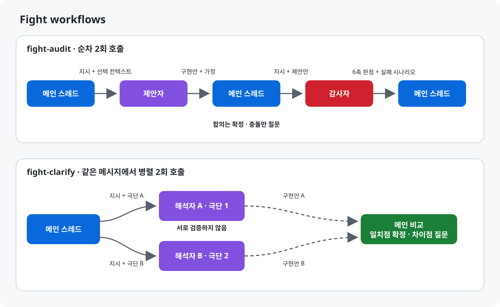

# fight


**적대적 검증 플러그인.** 유저의 지시나 제안을 컨텍스트가 격리된 서브에이전트에게 붙여, 메인 스레드 단독으로는 나오지 않는 검증과 대안을 얻는다. 두 플랫폼은 공통 프로토콜 본문을 공유하지만, 호출 문법·서브에이전트 도구·훅·모델 해석은 다르다. 이 플러그인에는 서브에이전트 호출을 실행·강제하는 코드는 없고, 호스트 에이전트가 `SKILL.md`의 프로토콜을 수행한다. Node.js SessionStart 훅은 Claude Code에만 있다.

## 왜 필요한가

단일 컨텍스트의 LLM 세션은 유저 제안에 무비판적으로 동의하는 경향(동조)이 있다. 또한 유저 본인도 아직 언어화하지 못한 요구를, 메인 스레드 혼자서는 실물 대안으로 드러내기 어렵다.

이 설계가 기대하는 근거는 "토론"이 아니라 **컨텍스트 격리**다. 플랫폼이 제공하는 별도 컨텍스트 창에서는 메인 스레드의 추론 캐시를 공유하지 않는다. 다만 이 플러그인이 메인의 의견·유저 선호를 자동 탐지하거나 전달 프롬프트에서 제거하지는 않는다. 어떤 텍스트를 넘길지는 `SKILL.md`를 따르는 메인 에이전트가 결정한다. 자세한 설계 근거는 [`docs/superpowers/specs/2026-08-27-fight-plugin-design.md`](docs/superpowers/specs/2026-08-27-fight-plugin-design.md)에 있다.

## 핵심 개념

플러그인은 스킬 두 개를 제공한다. 구조가 다른 이유는 편의가 아니라 잡으려는 오류의 종류가 다르기 때문이다.

| | `fight-audit` | `fight-clarify` |
|---|---|---|
| 구조 | 비대칭 (제안자 → 감사자) | 대칭 (해석자 A ‖ 해석자 B) |
| 호출 순서(프로토콜) | 순차 2회 | 병렬 2회 (같은 메시지) |
| 잡는 오류 | 편향 — 동조, 놓친 리스크 | 분산 — 서로 다른 해석 |
| 쓰는 시점 | 되돌리기 비용이 큰 판단 (아키텍처, 구현 방향, 의존성 추가) | 지시가 여러 해석을 허용할 때 |
| 출력 | 권장안 또는 확정 보류 + BLOCK 처리·미검증·WARN/NOTE | 두 안의 차이와 근거 없는 가정 |

같은 모델 두 개로 대칭을 구성하면 동조 방지가 원리적으로 성립하지 않는다 — 같은 모델은 같은 지시에 같은 방향으로 아부한다. `fight-audit`은 그래서 비대칭 구조로 편향을 잡고, `fight-clarify`는 애초에 편향이 아니라 해석 공간을 벌리는 게 목적이므로 대칭으로 둔다.

호출 수·순서·병렬성은 `SKILL.md`가 호스트 에이전트에 요구하는 규칙이다. 플러그인 파일만으로 이를 계수하거나 강제하지는 않는다.

## 설치

### Claude Code

```
/plugin marketplace add Ethualo/fight-skill
/plugin install fight@fight
```

로컬 체크아웃에서 설치하려면 `/plugin marketplace add C:\경로\fight-skill`처럼 로컬 클론 경로를 쓴다.

갱신은 `/plugin marketplace update fight` 다음 `/plugin update fight@fight`, 그다음 `/reload-plugins` 또는 Claude Code 재시작 순서다. marketplace 갱신을 건너뛰면 로컬 캐시가 낡은 상태로 남을 수 있다.

### Codex

Codex는 저장소 루트의 [`.agents/plugins/marketplace.json`](.agents/plugins/marketplace.json)에서 이 플러그인을 `fight-skill`로 제공한다.

```
codex plugin marketplace add Ethualo/fight-skill
codex plugin add fight-skill@fight-skill
```

로컬 체크아웃은 첫 명령의 `Ethualo/fight-skill`을 저장소 경로로 바꾼다. 갱신은 `codex plugin marketplace upgrade fight-skill` 뒤에 다시 `codex plugin add fight-skill@fight-skill`을 실행하고, 새 Codex task에서 확인한다. 유지보수·모델 정책은 [AGENTS.md](AGENTS.md) 참고.

## 빠른 시작

설치 후 대화 중 아래처럼 호출한다. 호출 문법은 플랫폼마다 다르다.

**Claude Code** (플러그인 네임스페이스 `fight`):

```
/fight:fight-audit로 이 구현 방향을 검증해줘.
/fight:fight-clarify로 이 지시의 양극단 구현안을 보여줘.
```

**Codex:**

```
$fight-audit로 이 구현 방향을 검증해줘.
$fight-clarify로 이 지시의 양극단 구현안을 보여줘.
```

`fight-audit` 예시 흐름: 제안자가 구현안을 내면(가정에 `[가정:근거]`/`[가정:공백]` 태그), 감사자가 여섯 축을 `BLOCK`/`WARN`/`NOTE`/`통과`/`미검증`으로 판정한다. 지적에는 구체적 실패 시나리오를, 미검증에는 확인 시도와 부족한 증거를 남긴다. 메인은 모든 `BLOCK`의 해결·기각·미해결 결과를 보존하고, 미해결 `BLOCK`이나 미검증이 남으면 확정을 보류한다. 여섯 축이 모두 통과면 억지 지적 없이 "이의 없음"으로 끝난다.

`fight-clarify` 예시 흐름: 애매함 축 하나를 골라 두 해석자를 양극단(A/B)으로 병렬 호출한다. 근거 있는 일치점은 재질문하지 않고, 차이점과 결과에 영향을 주는 근거 없는 가정을 사용자에게 묻는다. 근거 없는 공통 가정은 미확정으로 남긴다. 진행 중 질문에는 같은 스킬로 재진입하는 옵션을 붙이지 않는다.

## 아키텍처



## 구조

| 경로 | 역할 |
|---|---|
| `.claude-plugin/plugin.json` | Claude Code 플러그인 매니페스트 |
| `.claude-plugin/marketplace.json` | 마켓플레이스 매니페스트. 설치 진입점 |
| `.codex-plugin/plugin.json` | Codex 플러그인 매니페스트 |
| `.agents/plugins/marketplace.json` | Codex repo marketplace. 저장소 루트 플러그인을 노출 |
| `AGENTS.md` | Codex가 읽는 작업 지침 |
| `CLAUDE.md` | Claude Code가 읽는 작업 지침 |
| `skills/fight-audit/SKILL.md` | 제안자·감사자 비대칭 검증. 순차 2회 호출. 양 플랫폼 공유 |
| `skills/fight-clarify/SKILL.md` | 양극단 해석 분기. 병렬 2회 호출. 양 플랫폼 공유 |
| `hooks/hooks.json` | SessionStart 훅 정의 (Claude Code 전용) |
| `hooks/askuserquestion-rule.md` | 훅이 주입하는 규칙 전문 |
| `docs/superpowers/specs/` | 설계 스펙 (플랫폼 공통 근거) |
| `docs/superpowers/plans/` | 최초 Claude Code 구현 계획 (역사 기록) |
| [`CHANGELOG.md`](CHANGELOG.md) | 버전별 변경 이력 |

## 모델 요청 규칙

| 플랫폼 | `fight-audit` | `fight-clarify` |
|---|---|---|
| Claude Code | 제안자 `sonnet`, 감사자 `opus` | 두 호출 모두 `sonnet` 고정 |
| Codex | 제안자 `gpt-5.6-terra`(xhigh), 감사자 `gpt-5.6-sol`(medium) | 두 호출 모두 `gpt-5.6-luna`(max) |

표의 값은 `SKILL.md`가 호스트에 요청하는 모델·reasoning effort이지, 매니페스트가 강제하는 실행 설정은 아니다. Claude Code는 조직 허용 목록에 따라 요청 모델을 대체할 수 있고, Codex도 호스트의 모델 가용성에 좌우된다. 요청한 설정을 지킬 수 없거나 대체가 보고되면 메인 에이전트는 이를 밝히고 검증 호출을 중단해야 한다. 이 중단은 메인 에이전트의 준수 규칙이며 플러그인 자체가 자동 검증·차단하지는 않는다.

## 검증 결과

릴리스 일치는 `python -X utf8 scripts/check_release.py`로 검사한다. 스킬의 행동과 호출 순서는 계획 문서의 시나리오 1–3을 실제 호출로 재현한다. 아래 표는 기존 검증 기록이며, 0.3.10 변경 검증 범위는 [회귀 검증 기록](docs/verification/0.3.10.md)을 참고한다.

| 시나리오 | 내용 | Claude Code | Codex |
|---|---|---|---|
| 1 | 타당한 지시 → 감사자가 "이의 없음"과 근거 여섯 줄을 반환한다 | 통과 | 기대값 미충족 — 제안안 결함으로 유효한 `BLOCK` 발생 |
| 2 | 결함 있는 지시 → 구체적 실패 시나리오와 함께 `BLOCK`이 나온다 | 통과 | 통과 |
| 3 | 모호한 지시 → 두 안이 실제로 갈리고, 일치 부분은 유저에게 묻지 않는다 | 통과 | 통과 |

## 제한사항

- 서브에이전트 호출은 스킬당 정확히 2회라는 프로토콜 규칙이다. 호스트가 이를 지키도록 지시하지만 플러그인 파일이 강제하지는 않는다.
- 판정은 메인 스레드가 한다. 제3의 심판 서브에이전트를 두지 않는다.
- 외부 provider·CLI·MCP를 호출하지 않는다. 지정 모델을 못 쓰거나 호스트가 대체하면 메인 에이전트가 중단해야 하며, 플러그인만으로는 이를 강제할 수 없다.
- `fight-clarify`는 애매함 축을 하나만 고른다. 두 개 이상 벌리면 두 안의 차이가 어느 축에서 왔는지 읽을 수 없다.
- Claude Code 훅은 Node.js에 의존한다 (`cat`/`echo` 대신 사용 — Windows `cmd`·UTF-8 여러 줄 문제 회피). 이는 규칙 주입용 실행 코드일 뿐 서브에이전트 오케스트레이터는 아니다.

## 기여

[CONTRIBUTING.md](CONTRIBUTING.md) 참고.

## 라이선스

[MIT](LICENSE)

## 문의

작성: [Ethualo](https://github.com/Ethualo). 이슈·제안은 저장소 이슈 트래커로.
